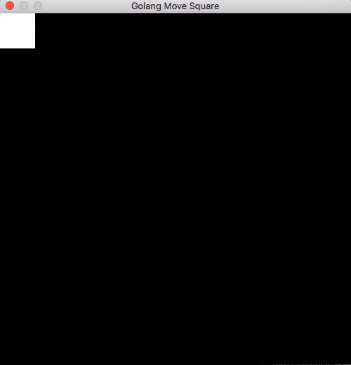

#  Golang Moving Square Test

A simple program that opens a window with a black background and a white square that you can move with the arrow keys. I wanted to test Go's interop with C and its Webassembly capabilities. 

I used emoon's [minifb](https://github.com/emoon/minifb) for the desktop version. I've only built it for Mac but it should work on Windows, Linux and FreeBSD as these platforms are supported by minifb.

I used [tinygo](https://github.com/tinygo-org/tinygo) to build the web version




## Build Instructions
clone recursively with:
 ```
 git clone --recursive https://github.com/phillvancejr/golang-moving-square.git
 ```
### Desktop with Minifb
#### Mac
For mac you can use the makefile provided. Minifb uses CMake so you need that in your path.
```
make minifb
make desktop
```
For other desktop Os' look at minifb's [build instructions](https://github.com/emoon/minifb#Build-instructions)

#### minifb.go
In minifb.go add `#cgo <os> LDFLAGS: -Ldeps/<os> -lminifb` 
```
#cgo CFLAGS: -Ideps/minifb/include
#cgo darwin LDFLAGS: -Ldeps/mac -lminifb
#cgo darwin LDFLAGS: -framework MetalKit -framework Metal -framework Cocoa
#cgo <os> LDFLAGS: -Ldeps/<os> -lminifb
#include <MiniFB.h>
#include <stdlib.h>
```
### Web with Wasm & TinyGo
You need tinygo in your path of course, then if using the makefile
```
make web
make server
./server
```
The server defaults to port 8000 but you can pass another port on the command line

## Controls
Just use the arrow keys to move around and escape key to close the window on desktop